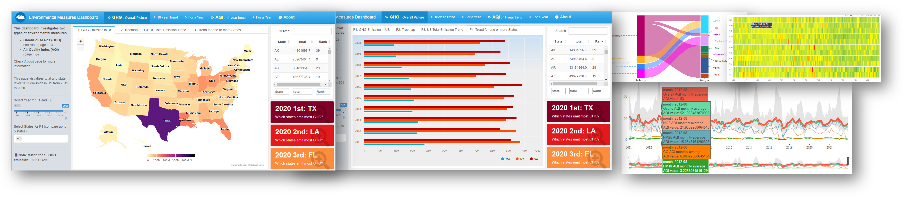

# Environmental Measures Dashboard with R shiny and flexdashboard

- version 2

## Author
- Zhinan Li

## Dashboard Link
Open the dashboard with this link:  
 [**Environmental Measures Dashboard with R shiny and flexdashboard_v2**](https://qgqi6j-zhinan-li.shinyapps.io/environmental-measures-dashboard_v2/)

## Dashboard Screenshot
### page 1
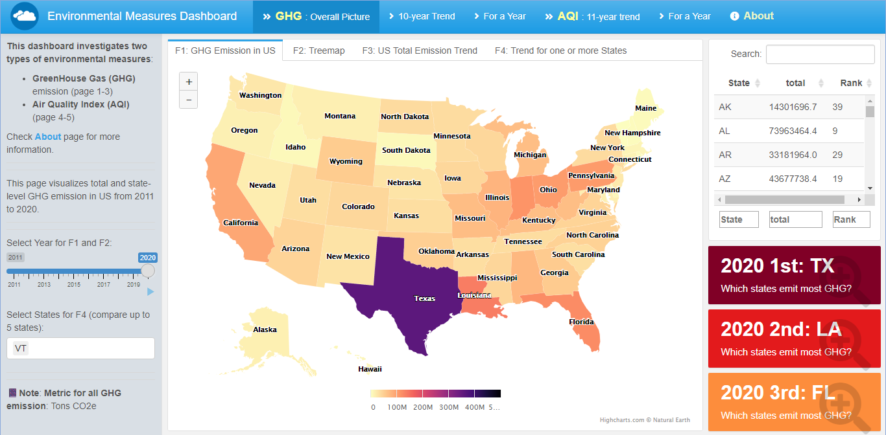   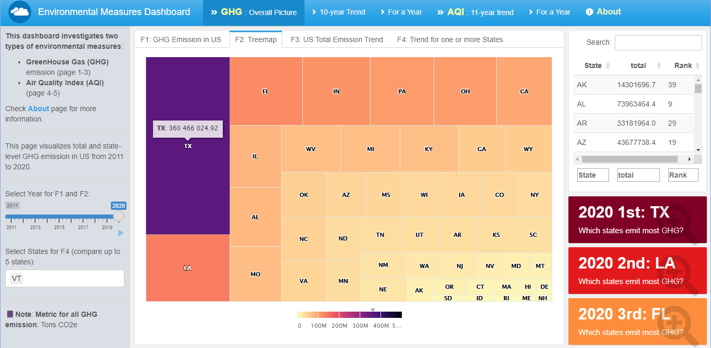
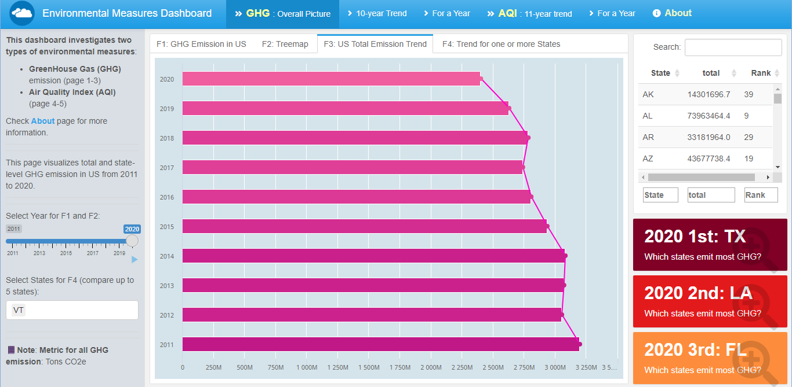   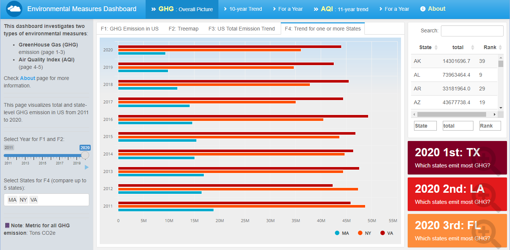
### page 2
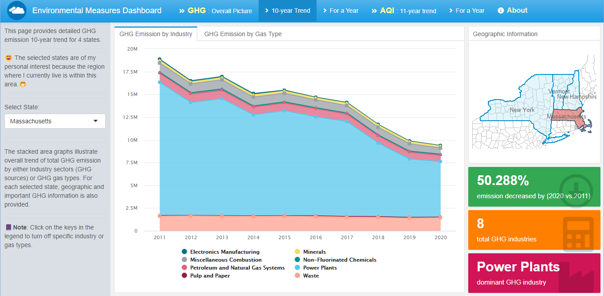   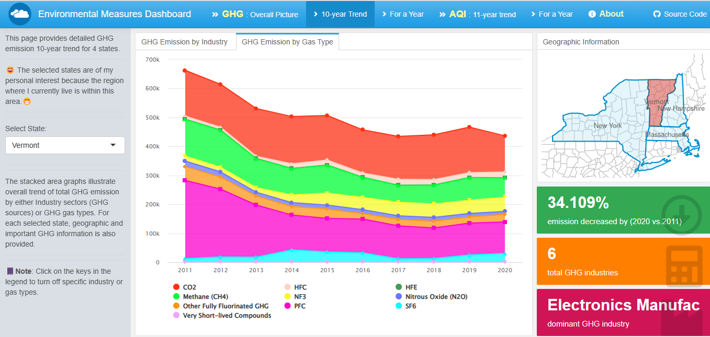
### page 3
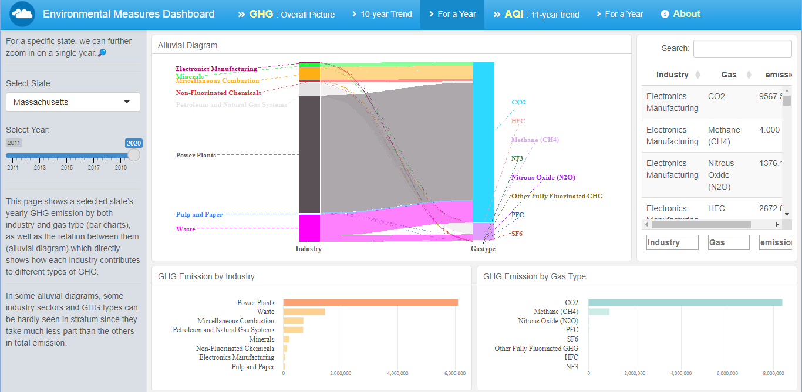

### page 4
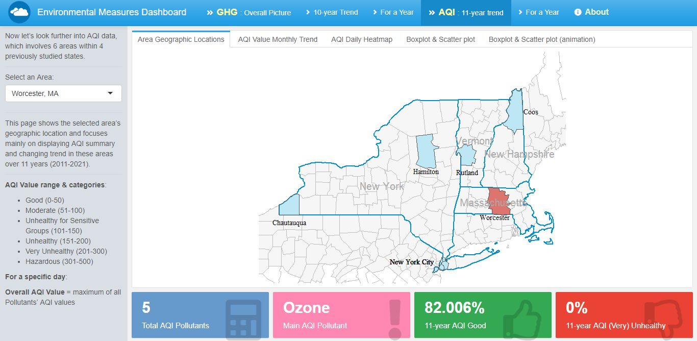   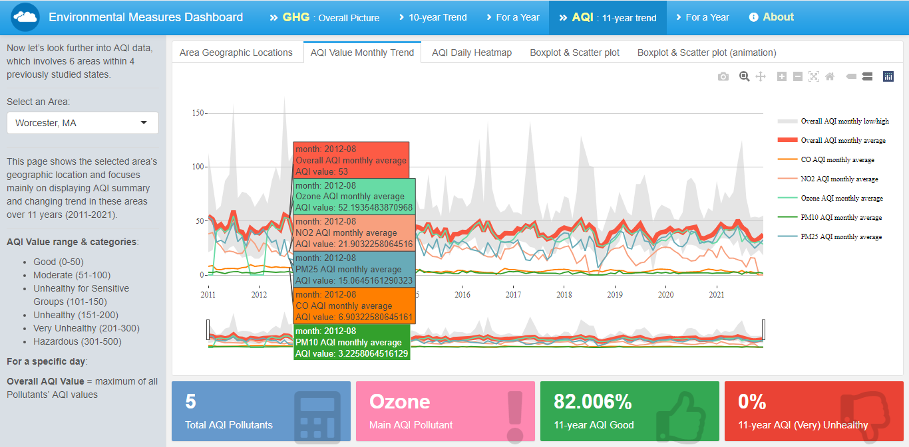
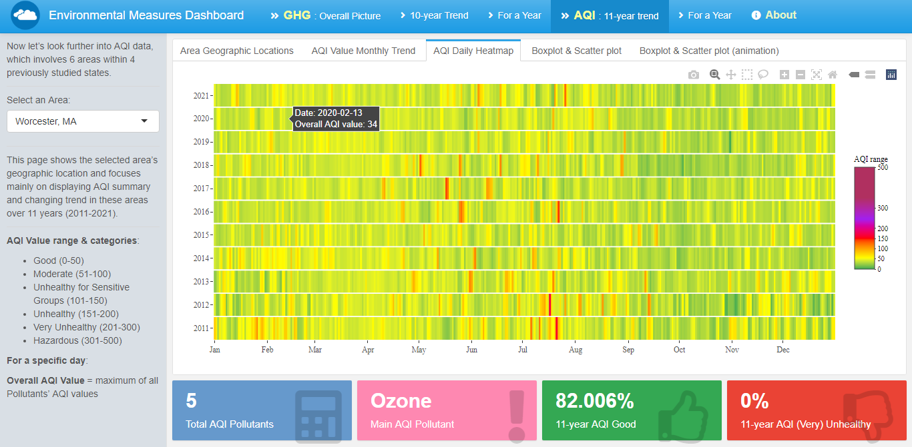   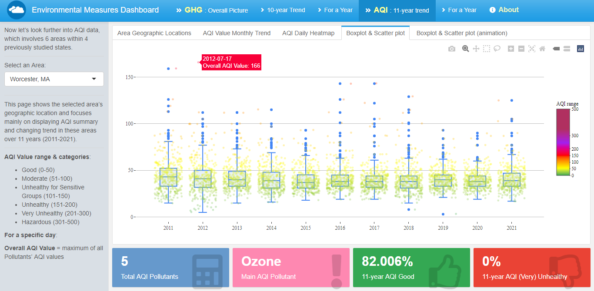

### page 5
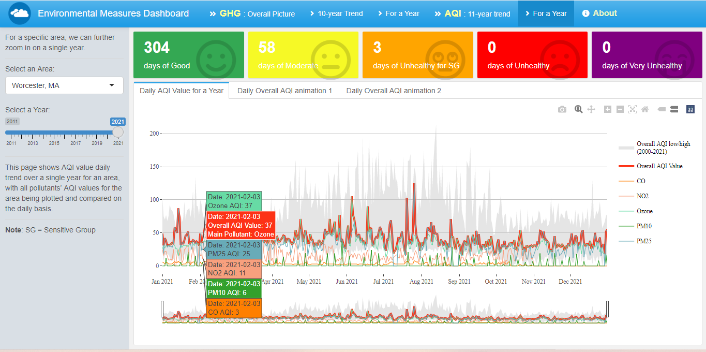

## Table of Contents

- [Motivation and Advantage](#motivation-and-advantage)
- [Dashboard Link and Overall Description](#dashboard-link-and-overall-description)
- [Data Source and License](#data-source-and-license)
- [Programming Languages and Main Packages](#programming-languages-and-main-packages)
- [License](#license)

## Motivation and Advantage

🌍🌎🌏 Climate change has increasingly raised people's awareness of environment protection. One related question we keep asking is that: What situation are we facing right now, and what will our environmental condition look like in the near future?  

The creation of this dashboard is inspired directly by this issue. Specifically, this dashboard investigates two types of environmental measures: GreenHouse Gas (GHG) emission and Air Quality Index (AQI), both of which are among the most important quantifying metrics to our air and environmental conditions. It starts from giving a whole picture of state-level GHG emission trend in US, then dives further into more detailed GHG and AQI visualization for some specific states (areas). The selected states for in-depth analysis are of my personal interest because the region where I currently live is within one of them.

Visualization design in this dashboard are motivated by maximizing data story-telling power. Users can take full advantages of its interactivity, interpret data intuitively, and easily get insights from the data. 

## Dashboard Link and Overall Description

- This interactive dashboard is published on shinyapps.io. Here is the link ➡️🔗:
 [**Environmental Measures Dashboard with R shiny and flexdashboard_v2**](https://qgqi6j-zhinan-li.shinyapps.io/environmental-measures-dashboard_v2/)
- This dashboard is programmed in R and enables interactivity by using Shiny with flexdashboard.

- This dashboard focuses on data visualization or data story telling. Visualizations here are created mainly with highcharter, ggplot2, plotly, simple features (sf) packages, depict data in different ways with a variety of graph types (including animation), and enable users to easily conduct data analysis and further pull insight from the data.
- All the read-in data has been properly cleaned, combined, and wrangled separately from the dashboard R Markdown (.rmd) file based on the originally collected data. Data cleaning is completed with Python3 using numpy and pandas. Both originally collected data (in folder "original-data")and read-in data after cleaning (in folder "data") is included in this repository.
- Data cleaning process (check the Jupyter notebook file envr-meas-dashboard_v2_data-wrangling.ipynb in the repository) mainly involves data reshaping and combining, as well as dealing with a small part of missing data with little manipulation. Therefore, the originally collected data can be fully reflected in the visualizations.

## Data Source and License

**Data Webpage and License**:

- All the original data for this dashboard is collected from [**United States Environmental Protection Agency (EPA)**](https://www.epa.gov).
- Data Licensing Information: https://edg.epa.gov/epa_data_license.html

**Greenhouse Gas (GHG) Emission Data**:

- Source webpage: [**Greenhouse Gas Reporting Program (GHGRP) State and Tribal Fact Sheet**](https://www.epa.gov/ghgreporting/ghgrp-state-and-tribal-fact-sheet)

**Air Quality Index (AQI) data**:

- Source webpage 1: [**Air Quality Index Daily Values Report**](https://www.epa.gov/outdoor-air-quality-data/air-quality-index-daily-values-report)
- Source webpage 2: [**Air Data - Daily Air Quality Tracker**](https://www.epa.gov/outdoor-air-quality-data/air-data-daily-air-quality-tracker)
- Data Codebook: https://www.epa.gov/outdoor-air-quality-data/about-air-data-reports
- Technical Document on AQI Calculation: https://www.airnow.gov/sites/default/files/2020-05/aqi-technical-assistance-document-sept2018.pdf

You can find more information about the data and data source on **About** page of the dashboard.

## Programming Languages and Main Packages

**R packages**: 

- for Interactive Dashboard: shiny, flexdashboard

- for Data Visualization: highcharter, ggplot2, plotly, simple features (sf), ggalluvial

- for Data Wrangling: tidyverse, lubridate

**Python packages**:

- Data Cleaning and Wrangling: numpy, pandas

## License

- Apache License 2.0
***
### 🎉🎉🎉 Thank you for checking out this dashboard! 🎉🎉🎉
